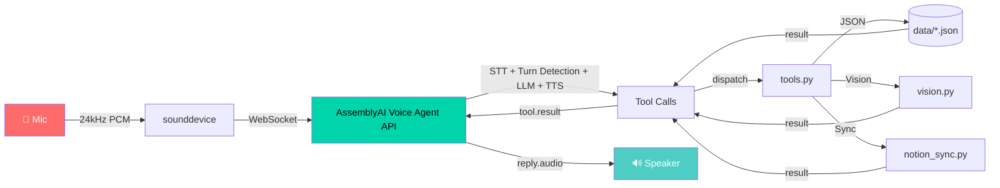

# E.V. — Voice-First Hackathon Command Center

[](https://lablab.ai/ai-hackathons/assemblyai-voice-agent-hackathon)
[](https://python.org)
[](LICENSE)


Built for the [AssemblyAI Voice Agent Hackathon](https://lablab.ai/ai-hackathons/assemblyai-voice-agent-hackathon) (Sept 1–30, 2026).

E.V. is a real-time voice agent, built entirely on AssemblyAI's **Voice Agent
API** (one WebSocket = STT + turn detection + LLM + TTS + tool calling), that
lets you capture tasks and notes hands-free while you're heads-down building —
then gives you a spoken briefing on demand. Optionally, newly-added tasks
mirror into an existing Notion workspace.

> **Watch the demo:** [YouTube](https://youtube.com/your-demo-link) | [Loom](https://loom.com/your-demo-link) *(add links after recording)*

## Why this project

Hackathon prep means juggling a dozen things across multiple projects at
once, and reaching for a keyboard to jot down "remember to test the LoRa
module before Thursday" breaks flow. E.V. is a voice-only capture layer for
exactly that: talk to it, it listens, logs, and reports back — nothing to
type, nothing to tab away to.

## What it does

Talk to E.V. and it will:

- **`add_task`** — "Remind me to finish the SWAP writeup, high priority, due
  Friday" → logged, with the relative date resolved into a real calendar date.
- **`list_tasks`** — "What's still pending?" → reads them back.
- **`complete_task`** — "I finished the LoRa test" → marks it done.
- **`delete_task`** — "Actually, forget that task" → removed entirely
  (different from completing it).
- **`add_note`** — "Note: the sensor drifts above 40 degrees" → logged.
- **`delete_note`** — "Delete that note" → removed entirely.
- **`undo_last`** — "Undo that" / "oops, scratch that" right after adding
  something → removes whatever was just added, no need to repeat it.
- **`search`** — "Did I note anything about sensor drift?" → keyword search
  across tasks and notes.
- **`get_briefing`** — "What's on my plate today?" → a spoken summary of
  pending tasks (highest priority first), anything overdue or due today,
  and recent notes. E.V. also volunteers this proactively: if you have
  overdue tasks, the very first thing it says on connect mentions them,
  before you ask.
- **`list_projects`** — "What's going on across my projects?" → tasks
  grouped by project (SWAP, LoRa test, coursework, …) instead of one flat list.
- **`set_voice`** — "Switch to a deeper voice" → E.V. reconnects with a
  different TTS voice (12 available — American/British English).
- **`end_session`** — "That's it for now" → ends the session cleanly
  (sends `session.end`, skipping the billable 30s resume window) instead
  of you having to Ctrl+C.
- **`remember_fact`** — "Remember that my LoRa module is a Core1262-HF" →
  saved permanently, and quietly loaded back into E.V.'s system prompt on
  every future run, so it carries into later sessions without you having
  to repeat yourself.
- **`read_screen`** — "What does this error say?" → takes a screenshot and
  answers, via a separate vision call to Claude. Optional — off by default.

All of the voice pipeline runs through a single AssemblyAI WebSocket
connection (STT, turn detection, LLM, TTS) — `read_screen` is the one
exception: it makes its own separate call to a vision-capable model purely
to describe the screenshot in text, since the Voice Agent API itself is
audio-only. AssemblyAI's Voice Agent LLM is still what decides when to call
it and what to say about the result out loud.

> **Note on `set_voice`:** AssemblyAI's Voice Agent API binds the TTS voice
> to the WebSocket connection at session start — it's immutable for the
> life of that connection. So "switching voices" here means E.V. cleanly
> ends the current session and opens a fresh one with the new voice,
> which takes a second or two and starts a new conversation turn (task/note
> data persists across the switch since it's all in local JSON — only the
> live conversation context resets).

## Architecture




| File | Purpose |
|---|---|
| `agent.py` | WebSocket session loop: streams mic audio, routes events, dispatches tool calls, handles voice-switch reconnects and clean session end |
| `audio.py` | Mic capture / speaker playback at 24kHz 16-bit mono PCM |
| `prompts.py` | E.V.'s system prompt (built fresh each session, injecting today's date and remembered facts) and its greeting (proactively mentions overdue tasks) |
| `tools.py` | Tool schemas sent to the API + dispatcher that runs them |
| `storage.py` | Local JSON persistence for tasks, notes, and remembered facts (`data/tasks.json`, `data/notes.json`, `data/memory.json`) |
| `vision.py` | Optional `read_screen` support — screenshot capture + a Claude vision API call |
| `notion_sync.py` | Optional, best-effort mirror of new tasks into a Notion database |

## Setup

**1. Audio backend**

This uses `sounddevice` (PortAudio bindings) rather than PyAudio, specifically
because PyAudio needs a C compiler on Windows (Microsoft Visual C++ Build
Tools) to build its native extension whenever no prebuilt wheel matches your
Python version — a common wall on newer Python releases. `sounddevice` ships
PortAudio as a bundled binary and installs cleanly with plain `pip install`
on Windows, macOS, and Linux, no compiler needed.

**2. Python environment**

```bash
python -m venv venv
venv\Scripts\activate        # Windows
# source venv/bin/activate   # macOS/Linux

pip install -r requirements.txt
```

**3. API key**

Copy `.env.example` to `.env` and fill in your AssemblyAI API key (from your
[AssemblyAI dashboard](https://www.assemblyai.com/app) — you need Voice
Agent API access). Notion and Anthropic variables are optional; leave them
blank to run with just tasks/notes/memory on local JSON.

**4. Run it**

```bash
python agent.py
```

Speak once you see `Session ready`. Use headphones if possible — speaker
playback into an open mic can trigger false interruptions.

## Features in Action

| Feature | Demo |
|---------|------|
| **Proactive Briefing** |  |
| **Barge-in / Interrupt** |  |
| **Voice Switching** |  |
| **Screen Reading** |  |
| **Task/Note CRUD** |  |

*Record short 5-10s GIFs for each feature using [ScreenToGif](https://www.screentogif.com/) or [Peek](https://github.com/phw/peek) and place in `assets/` folder.*

## Demo script (for the submission video)

1. "Hey E.V." → greeting plays (mentions overdue tasks first, if any).
2. "Add a task: test the dual LoRa module, high priority, due tomorrow." →
   confirms, with the due date resolved.
3. "Add a note: sensor readings drift above 40 degrees Celsius." → confirms.
4. "Undo that." → the note you just added is removed — a quick safety-net
   demo.
5. "Add a note: sensor readings drift above 40 degrees Celsius." → add it
   back for real.
6. "What's on my plate today?" → spoken briefing, calls out anything overdue.
7. "What's going on across my projects?" → project-by-project breakdown.
8. "Did I note anything about sensor drift?" → search finds the note.
9. "Remember that my LoRa module is a Waveshare Core1262-HF." → saved.
10. "Switch to a deeper voice." → E.V. reconnects and speaks the rest in a
    different voice.
11. *(optional, needs `ANTHROPIC_API_KEY`)* "What's on my screen right now?"
    → screenshot taken, described out loud.
12. "I finished testing the LoRa module." → marks it complete.
13. "What's still pending?" → reads back the updated list.
14. "That's it for now." → ends the session cleanly.
15. *(optional)* show `data/tasks.json` updating live, and/or the Notion
    database receiving the new row. Restart the agent and ask "what do you
    know about me?" to show the remembered fact carrying over.

Keep the video under 3–5 minutes: show the working loop end-to-end rather
than narrating the code.

## Submission checklist — lablab.ai (deadline Sept 30, 2026)

- [ ] Working voice agent demo video (screen + audio, shows real interaction)
- [ ] Public GitHub repo (push this project, keep `.env` out of it — already
      gitignored)
- [ ] Project write-up: problem, what you built, how AssemblyAI's Voice
      Agent API is used, what's novel (voice-first + tool calling into a
      real personal workflow, optional Notion sync)
- [ ] Submit on the hackathon page before Sept 30, 2026
- [ ] Mention specifically which AssemblyAI features you used (STT, turn
      detection, LLM tool calling, TTS voice) — judges are evaluating
      "meaningful demonstration of voice AI technology," not just that it
      runs

## Optional: Notion sync setup

1. Create an integration at <https://www.notion.so/my-integrations>, copy
   its secret into `NOTION_API_KEY` in `.env`.
2. Open your target Notion database → `•••` menu → Connections → add your
   integration.
3. Copy the database ID from its URL into `NOTION_TASKS_DB_ID`.
4. The database needs a title column (any name), and optionally a
   `Priority` select property and a `Project` text property — both are
   filled automatically if present, skipped if not.

If these aren't set, `notion_sync.py` is a no-op and the agent runs purely
on local JSON — safe for a live demo regardless of whether Notion is wired
up in time.

## Optional: screen reading (`read_screen`) setup

1. Get an API key at <https://console.anthropic.com/>.
2. Put it in `ANTHROPIC_API_KEY` in `.env`.
3. That's it — `read_screen` takes a screenshot with Pillow and sends it to
   `claude-haiku-4-5-20251001` (fast/cheap; override with
   `ANTHROPIC_VISION_MODEL` if you want a different model) for a short
   spoken description.

If `ANTHROPIC_API_KEY` isn't set, `read_screen` just says so out loud
instead of crashing the session.

## Extending it

Ideas if there's time left before the deadline:
- Swap the JSON store for real Notion as the source of truth (read-through
  `list_tasks`, not just write-through `add_task`).
- Push actual OS/calendar notifications for `due_date`s, not just a mention
  in the spoken briefing or the proactive greeting.
- Deploy via AssemblyAI's browser or Twilio channel instead of running
  locally, for a shareable demo link.

## Quick Start (Animated)


```bash
# 1. Clone & enter
git clone https://github.com/shiv2803/ev-voice-agent.git
cd ev-voice-agent

# 2. Setup venv
python -m venv venv
venv\Scripts\activate          # Windows
# source venv/bin/activate     # macOS/Linux

# 3. Install deps
pip install -r requirements.txt

# 4. Configure API key
cp .env.example .env
# edit .env → add ASSEMBLYAI_API_KEY

# 5. Run E.V.
python agent.py
```

*Record a 15-30s GIF of the full setup-to-run flow.*

## Contributing

PRs welcome! Ideas:
- 🎤 Add more voices / languages
- 🔌 Plugin SDK for custom tools
- 📱 Browser / Twilio deployment
- 🧠 Offline STT fallback (whisper.cpp)

## License

MIT — see [LICENSE](LICENSE) for details.

---

<p align="center">
  <b>Built with ❤️ for the AssemblyAI Voice Agent Hackathon</b><br>
  <sub>Team <b>Barge-In</b> • Deadline: Sept 30, 2026</sub>
</p>
