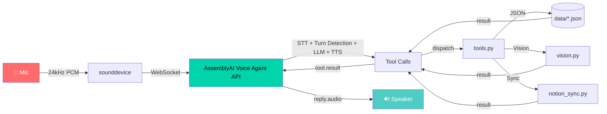

# E.V. — Voice-First Hackathon Command Center

<p align="center">
  
</p>

<p align="center">
  
  
  
  
  
</p>

<div align="center">
  <svg width="980" height="260" viewBox="0 0 980 260" fill="none" xmlns="http://www.w3.org/2000/svg">
    <defs>
      <linearGradient id="bgGlow" x1="0" y1="0" x2="980" y2="260" gradientUnits="userSpaceOnUse">
        <stop offset="0" stop-color="#0F172A"/>
        <stop offset="0.5" stop-color="#111827"/>
        <stop offset="1" stop-color="#0B1120"/>
      </linearGradient>
      <linearGradient id="wave" x1="40" y1="110" x2="900" y2="110" gradientUnits="userSpaceOnUse">
        <stop offset="0" stop-color="#22D3EE"/>
        <stop offset="0.35" stop-color="#60A5FA"/>
        <stop offset="0.7" stop-color="#A78BFA"/>
        <stop offset="1" stop-color="#34D399"/>
      </linearGradient>
      <linearGradient id="waveFlow" x1="40" y1="110" x2="900" y2="110" gradientUnits="userSpaceOnUse">
        <stop offset="0" stop-color="#22D3EE" stop-opacity="0"/>
        <stop offset="0.3" stop-color="#22D3EE" stop-opacity="1"/>
        <stop offset="0.7" stop-color="#34D399" stop-opacity="1"/>
        <stop offset="1" stop-color="#34D399" stop-opacity="0"/>
      </linearGradient>
    </defs>

    <rect width="980" height="260" rx="26" fill="url(#bgGlow)"/>
    
    <!-- Animated background glow circles -->
    <g opacity="0.18">
      <circle cx="150" cy="130" r="120" fill="#38BDF8">
        <animate attributeName="r" values="120;140;120" dur="4s" repeatCount="indefinite"/>
        <animate attributeName="opacity" values="0.18;0.3;0.18" dur="4s" repeatCount="indefinite"/>
      </circle>
      <circle cx="820" cy="150" r="150" fill="#A78BFA">
        <animate attributeName="r" values="150;170;150" dur="5s" repeatCount="indefinite"/>
        <animate attributeName="opacity" values="0.18;0.3;0.18" dur="5s" repeatCount="indefinite"/>
      </circle>
      <circle cx="500" cy="40" r="90" fill="#34D399">
        <animate attributeName="r" values="90;110;90" dur="6s" repeatCount="indefinite"/>
        <animate attributeName="opacity" values="0.18;0.3;0.18" dur="6s" repeatCount="indefinite"/>
      </circle>
    </g>

    <!-- Animated wave path with flowing gradient -->
    <path id="wavePath" d="M60 134C130 134 130 76 200 76C270 76 270 170 340 170C410 170 410 92 480 92C550 92 550 165 620 165C690 165 690 96 760 96C830 96 830 132 900 132" 
          stroke="url(#wave)" stroke-width="5" stroke-linecap="round" fill="none" stroke-dasharray="1000" stroke-dashoffset="0">
      <animate attributeName="stroke-dashoffset" values="0;-1000" dur="3s" repeatCount="indefinite"/>
    </path>
    <!-- Second wave layer with flowing highlight -->
    <path d="M60 134C130 134 130 76 200 76C270 76 270 170 340 170C410 170 410 92 480 92C550 92 550 165 620 165C690 165 690 96 760 96C830 96 830 132 900 132" 
          stroke="url(#waveFlow)" stroke-width="3" stroke-linecap="round" fill="none" stroke-dasharray="200 400" stroke-dashoffset="0">
      <animate attributeName="stroke-dashoffset" values="0;-600" dur="2s" repeatCount="indefinite"/>
    </path>

    <!-- MIC node with pulse -->
    <g>
      <circle cx="80" cy="134" r="26" fill="#0F172A" stroke="#7DD3FC" stroke-width="2">
        <animate attributeName="stroke-width" values="2;4;2" dur="2s" repeatCount="indefinite"/>
        <animate attributeName="r" values="26;30;26" dur="2s" repeatCount="indefinite"/>
      </circle>
      <text x="80" y="141" text-anchor="middle" fill="#E2E8F0" font-size="11" font-family="Arial" font-weight="700">MIC</text>

      <!-- Animated data packets flowing from MIC -->
      <circle cx="130" cy="76" r="8" fill="#22D3EE" opacity="0.9">
        <animateMotion path="M130 76C160 76 160 170 200 170C240 170 240 92 280 92C320 92 320 165 360 165C400 165 400 96 440 96C480 96 480 132 520 132" dur="4s" repeatCount="indefinite" rotate="auto"/>
        <animate attributeName="opacity" values="0;1;0" dur="4s" repeatCount="indefinite"/>
      </circle>
      <circle cx="130" cy="76" r="6" fill="#A78BFA" opacity="0.9">
        <animateMotion path="M130 76C160 76 160 170 200 170C240 170 240 92 280 92C320 92 320 165 360 165C400 165 400 96 440 96C480 96 480 132 520 132" begin="1.3s" dur="4s" repeatCount="indefinite" rotate="auto"/>
        <animate attributeName="opacity" values="0;1;0" dur="4s" repeatCount="indefinite"/>
      </circle>
      <circle cx="130" cy="76" r="5" fill="#34D399" opacity="0.9">
        <animateMotion path="M130 76C160 76 160 170 200 170C240 170 240 92 280 92C320 92 320 165 360 165C400 165 400 96 440 96C480 96 480 132 520 132" begin="2.6s" dur="4s" repeatCount="indefinite" rotate="auto"/>
        <animate attributeName="opacity" values="0;1;0" dur="4s" repeatCount="indefinite"/>
      </circle>

      <circle cx="340" cy="170" r="18" fill="#A78BFA" opacity="0.9">
        <animate attributeName="r" values="18;22;18" dur="1.5s" repeatCount="indefinite"/>
      </circle>
      <circle cx="620" cy="165" r="18" fill="#34D399" opacity="0.9">
        <animate attributeName="r" values="18;22;18" dur="1.8s" repeatCount="indefinite"/>
      </circle>

      <circle cx="900" cy="132" r="26" fill="#0F172A" stroke="#34D399" stroke-width="2">
        <animate attributeName="stroke-width" values="2;4;2" dur="2s" repeatCount="indefinite"/>
        <animate attributeName="r" values="26;30;26" dur="2s" repeatCount="indefinite"/>
      </circle>
      <text x="900" y="139" text-anchor="middle" fill="#E2E8F0" font-size="11" font-family="Arial" font-weight="700">AUDIO</text>
    </g>

    <!-- AssemblyAI box with pulse -->
    <g>
      <rect x="395" y="40" width="190" height="64" rx="18" fill="#0F172A" stroke="#7DD3FC" stroke-opacity="0.9">
        <animate attributeName="stroke-opacity" values="0.9;1;0.9" dur="2s" repeatCount="indefinite"/>
      </rect>
      <text x="490" y="66" text-anchor="middle" fill="#7DD3FC" font-size="12" font-family="Arial" font-weight="700">AssemblyAI</text>
      <text x="490" y="85" text-anchor="middle" fill="#E2E8F0" font-size="12" font-family="Arial">Voice Agent API</text>

      <rect x="420" y="152" width="140" height="54" rx="16" fill="#0F172A" stroke="#A78BFA" stroke-opacity="0.9">
        <animate attributeName="stroke-opacity" values="0.9;1;0.9" dur="2.5s" repeatCount="indefinite"/>
      </rect>
      <text x="490" y="177" text-anchor="middle" fill="#E2E8F0" font-size="12" font-family="Arial" font-weight="700">Tools + Memory</text>
      <text x="490" y="196" text-anchor="middle" fill="#A78BFA" font-size="11" font-family="Arial">JSON / Notion</text>
    </g>

    <!-- Animated equalizer bars -->
    <g fill="#7DD3FC" opacity="0.9">
      <rect x="130" y="112" width="24" height="12" rx="6">
        <animate attributeName="height" values="12;36;12" dur="0.6s" repeatCount="indefinite"/>
        <animate attributeName="y" values="112;88;112" dur="0.6s" repeatCount="indefinite"/>
      </rect>
      <rect x="160" y="100" width="18" height="24" rx="6">
        <animate attributeName="height" values="24;42;24" dur="0.5s" begin="0.1s" repeatCount="indefinite"/>
        <animate attributeName="y" values="100;82;100" dur="0.5s" begin="0.1s" repeatCount="indefinite"/>
      </rect>
      <rect x="182" y="90" width="18" height="34" rx="6">
        <animate attributeName="height" values="34;50;34" dur="0.7s" begin="0.2s" repeatCount="indefinite"/>
        <animate attributeName="y" values="90;74;90" dur="0.7s" begin="0.2s" repeatCount="indefinite"/>
      </rect>
    </g>
  </svg>
</div>


> **Watch the demo:** [YouTube](https://youtube.com/your-demo-link) | [Loom](https://loom.com/your-demo-link) *(add links after recording)*

Built for the [AssemblyAI Voice Agent Hackathon](https://lablab.ai/ai-hackathons/assemblyai-voice-agent-hackathon) (Sept 1–30, 2026).

E.V. is a real-time voice agent built entirely on AssemblyAI's Voice Agent API. One WebSocket handles speech-to-text, turn detection, LLM orchestration, tool calling, and text-to-speech, so you can keep your hands on the work and your attention in the moment.

## Highlights

- Real-time voice-first task capture without a keyboard
- Single WebSocket pipeline for STT, turn detection, LLM orchestration, and TTS
- Persistent memory for project context, notes, and remembered facts
- Optional Notion sync and Claude-powered screen reading
- Designed for hackathon demos and everyday quick planning loops

## Why this project

Hackathon prep means juggling a dozen things at once. Reaching for a keyboard to type "remember to test the LoRa module before Thursday" breaks momentum. E.V. is a voice-first capture layer for tasks, notes, and project context that keeps you in flow.

## What E.V. can do

<div align="center">
  <table>
    <tr>
      <td width="50%" valign="top">
        <ul>
          <li><strong>add_task</strong> — "Remind me to finish the SWAP writeup, high priority, due Friday"</li>
          <li><strong>list_tasks</strong> — "What's still pending?"</li>
          <li><strong>complete_task</strong> — "I finished the LoRa test"</li>
          <li><strong>delete_task</strong> — "Forget that task"</li>
          <li><strong>add_note</strong> — "Note: the sensor drifts above 40 degrees"</li>
          <li><strong>delete_note</strong> — "Delete that note"</li>
          <li><strong>undo_last</strong> — "Undo that"</li>
        </ul>
      </td>
      <td width="50%" valign="top">
        <ul>
          <li><strong>search</strong> — "Did I note anything about sensor drift?"</li>
          <li><strong>get_briefing</strong> — "What's on my plate today?"</li>
          <li><strong>list_projects</strong> — "What's going on across my projects?"</li>
          <li><strong>set_voice</strong> — "Switch to a deeper voice"</li>
          <li><strong>end_session</strong> — "That's it for now"</li>
          <li><strong>remember_fact</strong> — "Remember my LoRa module is a Core1262-HF"</li>
          <li><strong>read_screen</strong> — "What does this error say?"</li>
        </ul>
      </td>
    </tr>
  </table>
</div>

E.V. also proactively speaks overdue reminders on connect, gives project-aware briefings, and keeps long-term context in memory so facts persist across sessions.

> The core voice pipeline runs through a single AssemblyAI WebSocket. The only exception is `read_screen`, which makes a separate vision request to describe a screenshot.

## Architecture




| File | Purpose |
|---|---|
| `agent.py` | Main WebSocket session loop: streams mic audio, routes events, dispatches tools, handles reconnects and clean session exit |
| `audio.py` | Mic capture and speaker playback using 24kHz 16-bit mono PCM |
| `prompts.py` | Builds the session system prompt, injects memory, and creates the proactive greeting |
| `tools.py` | Tool schemas plus the dispatcher that executes commands |
| `storage.py` | Local JSON persistence for tasks, notes, and remembered facts |
| `vision.py` | Optional screenshot capture and Claude-based screen reading |
| `notion_sync.py` | Best-effort sync of new tasks into a Notion database |

## Features in Action

| Feature | Demo |
|---------|------|
| **Proactive Briefing** |  |
| **Barge-in / Interrupt** |  |
| **Voice Switching** |  |
| **Screen Reading** |  |
| **Task/Note CRUD** |  |

*Record short 5-10s GIFs for each feature using [ScreenToGif](https://www.screentogif.com/) or [Peek](https://github.com/phw/peek) and place in `assets/` folder.*

## Setup

### 1) Audio backend

This uses `sounddevice` (PortAudio bindings) instead of PyAudio. That matters because PyAudio often requires Microsoft Visual C++ Build Tools on Windows when no matching wheel exists. `sounddevice` is usually the smoother option for local microphone/speaker setups.

### 2) Python environment

```bash
python -m venv venv
venv\Scripts\activate        # Windows
# source venv/bin/activate   # macOS/Linux

pip install -r requirements.txt
```

### 3) API keys

```bash
cp .env.example .env
```

Add your AssemblyAI API key to `.env`. Notion and Anthropic keys are optional — if they're blank, the agent still works using local JSON storage.

### 4) Run it

```bash
python agent.py
```

Speak once you see `Session ready`. Use headphones if possible so the speaker output does not bounce back into the mic.

## Quick Start (Animated)


```bash
# 1. Clone & enter
git clone https://github.com/shiv2803/ev-voice-agent.git
cd ev-voice-agent

# 2. Setup venv
python -m venv venv
venv\Scripts\activate          # Windows
# source venv/bin/activate     # macOS/Linux

# 3. Install deps
pip install -r requirements.txt

# 4. Configure API key
cp .env.example .env
# edit .env → add ASSEMBLYAI_API_KEY

# 5. Run E.V.
python agent.py
```

*Record a 15-30s GIF of the full setup-to-run flow.*

## Demo flow

1. "Hey E.V." → greeting plays, mentioning overdue tasks first if any.
2. "Add a task: test the dual LoRa module, high priority, due tomorrow." → task is created.
3. "Add a note: sensor readings drift above 40 degrees Celsius." → note is logged.
4. "Undo that." → the note is removed immediately.
5. "Add a note: sensor readings drift above 40 degrees Celsius." → add it back for real.
6. "What's on my plate today?" → spoken briefing with overdue tasks called out.
7. "What's going on across my projects?" → project-by-project breakdown.
8. "Did I note anything about sensor drift?" → search finds the note.
9. "Remember that my LoRa module is a Waveshare Core1262-HF." → memory persists.
10. "Switch to a deeper voice." → session reconnects with a fresh voice.
11. *(optional)* "What's on my screen right now?" → screenshot is captured and described aloud.
12. "I finished testing the LoRa module." → task is marked complete.
13. "What's still pending?" → updated list is read back.
14. "That's it for now." → session ends cleanly.
15. *(optional)* show `data/tasks.json` or the Notion database updating live.

Keep the final video under 3–5 minutes and focus on the working loop end-to-end rather than narrating the code.

## Troubleshooting

- No mic input: confirm your microphone is connected and selected in your OS audio settings.
- Session never starts: verify that `ASSEMBLYAI_API_KEY` is populated in `.env`.
- Audio output is echoing: use headphones instead of speakers while testing.
- Tool calls fail: check that your `.env` contains the required optional keys for Notion or Anthropic features.
- Tasks not persisting: confirm the `data/` directory is writable and that `storage.py` has permission to create JSON files.

## Submission checklist

- [ ] Working voice agent demo video with both screen and audio
- [ ] Public GitHub repo with `.env` kept out of version control
- [ ] Project write-up explaining the problem, solution, and AssemblyAI usage
- [ ] Submit before Sept 30, 2026
- [ ] Explicitly mention STT, turn detection, LLM tool calling, and TTS voice usage

## Optional: Notion sync

1. Create an integration at <https://www.notion.so/my-integrations>
2. Copy the integration secret into `NOTION_API_KEY`
3. Open the target database and connect the integration
4. Copy the database ID into `NOTION_TASKS_DB_ID`
5. Optional database properties: `Priority` and `Project`

If these values aren't configured, `notion_sync.py` becomes a no-op and E.V. still runs perfectly from local JSON storage.

## Optional: screen reading (`read_screen`)

1. Get an API key at <https://console.anthropic.com/>
2. Put it in `ANTHROPIC_API_KEY` in `.env`
3. That's it — E.V. captures a screenshot and sends it to Claude for a short spoken description

If the key is not present, E.V. simply says it cannot read the screen instead of crashing the session.

## Extending it

Ideas if time remains before the deadline:

- Replace the JSON store with Notion as the real source of truth
- Push OS or calendar notifications for due dates
- Deploy via AssemblyAI browser or Twilio channels for a shareable demo link

## Contributing

PRs welcome! Ideas:
- 🎤 Add more voices / languages
- 🔌 Plugin SDK for custom tools
- 📱 Browser / Twilio deployment
- 🧠 Offline STT fallback (whisper.cpp)

## License

MIT — see [LICENSE](LICENSE) for details.

---

<p align="center">
  
</p>